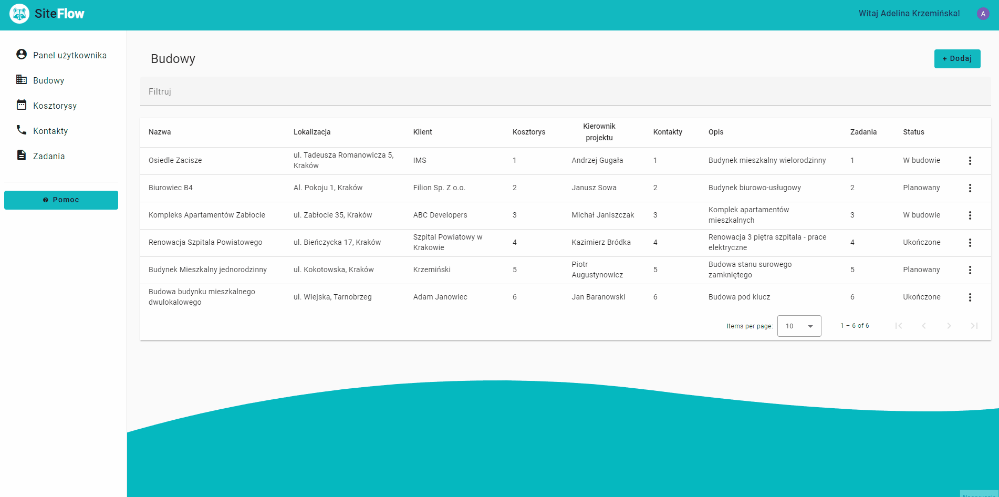
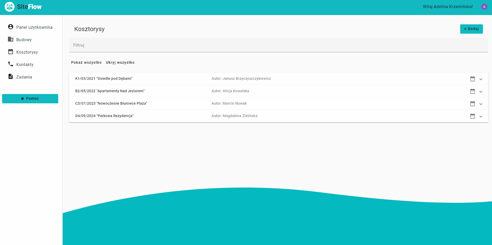
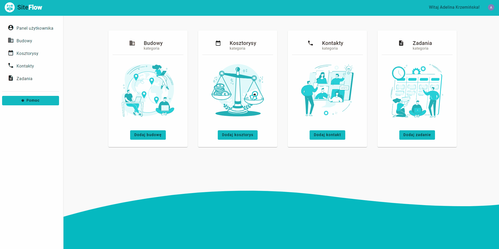

# Site Flow

## Overview
Welcome to SiteFlow, a comprehensive Angular 16 application designed for educational purposes in construction management. This multi-module application includes features for:
* Constructions
* Contacts
* Costs-estimates
* Tasks

Each feature operates within its dedicated module, offering a modular and organized structure.
Users can easily handle their construction projects, cost estimates, and contacts connected to specific tasks on a Kanban board. The app also gives a smooth experience with cool features like dark mode, logging in with Google OAuth and personalizing settings.

#### Live Demo: https://akrzeminska.github.io/site-flow


#### Documentation: https://akrzeminska.github.io/site-flow-documentation

## Table of Contents
* [Overview](#overview)
* [Credentials](#credentials)
* [Features](#features)
* [The building blocks of an application](#thebuildingblocksofanapplication)
* [Technologies Used](#technologies-used)
* [Installation](#installation)
* [Credits](#credits)
* [Author](#author)

## Credentials
To unlock the full potential of SiteFlow, log in using your Gmail account through OAuth.

## Features

### Angular Material Design
SiteFlow utilizes Angular Material Design for an enhanced user experience. It incorporates a custom theme, providing a visually appealing and consistent interface. Angular Material's pre-built components and the Component Dev Kit (CDK), including tables, cards, badges, dialogs, expansion panels, form fields, grid lists, icons, inputs, menus, paginators, radio buttons, selects, side navs, snack bars, and buttons, contribute to a modern and user-friendly design.
### Authentication
SiteFlow employs Google OAuth 2.0 for a secure and seamless login process. This integration ensures user credentials are managed by a trusted identity provider, enhancing both security and user convenience.
### Modular Structure
SiteFlow adopts a multi-module architecture, organizing features into separate modules. This approach enhances maintainability, scalability, and code organization. The application benefits from a clear separation between smart and dumb components, fostering a clean and maintainable codebase. Each feature (constructions, contacts, cost estimates, tasks) resides in its module, facilitating ease of development and future enhancements.
### Responsive Design
SiteFlow prioritizes a responsive web design (RWD) for a seamless user experience across various devices and screen sizes. Implementation includes Angular's Breakpoint Observer to adapt layouts dynamically based on device characteristics. 
### Routing
SiteFlow implements Angular routing with lazy loading for optimized application loading times. Each feature/module has its route, and modules load on-demand, enhancing overall performance.


### Services and Data Handling
* In the current version, the application exclusively stores data in the browser's cache using local storage. The use of abstract classes paves the way for future service substitutions capable of communicating with the backend.
Abstract classes eliminate the need to edit clients utilizing these services, aligning with the second SOLID principle — the Open/Closed Principle. This principle advocates for code closure to modifications but openness to extensions.
* The Seeder service injects essential data into local storage during application initialization, enhancing the initial user experience.
* Each application feature (constructions, contacts, cost estimates, tasks) has dedicated models and services, promoting modular organization and code clarity.

### Custom Theme
* Users can switch between light and dark themes based on their preferences, enhancing accessibility and user satisfaction.




### Feature Highlights
#### Constructions
* Uses Angular Material Table with Advanced Data Sources
* Pagination, sorting, and filtering implemented for a seamless user experience
* Construction forms with reactive forms and validation


#### Contacts
* Angular Material cards for contacts
* Dynamic header color based on contact category
* Avatar management, including uploading images and storing them as base64 in local storage


#### Costs estimates
* Expandable table for cost estimates
* Internal routing for efficient navigation within the cost estimates feature



#### Tasks
* Drag & Drop functionality using Angular Material for task management




## The building blocks of an application


## Technologies Used
This app was built using:

* Angular 16 
* Typescript
* RxJS
* HTML, CSS/SCSS
* Node.js
* NPM
* Module lazy loading
* OAuth 2.0
* Custom services based on SOLID principles and abstract classes
* Angular Material with a custom theme
* Responsive Web Design (RWD) with Breakpoint Observer
* Compodoc for documentation

## Roadmap
The application is under active development, and the following features are planned for future releases:

* Interactive cost estimate details with cost control
* Task management enhancements
* Weather API integration for real-time weather updates
* Guest login functionality
* User profiles and access management
* Internationalization (i18n)
* Hosting configuration beyond GitHub Pages
* Backend development and database schema creation

## Installation
To run the Site Flow application locally, follow these steps:

- Clone the repository: ```git clone https://github.com/akrzeminska/site-flow.git```

- Navigate to the project directory: ```cd site-flow```

- Install the required dependencies: ```npm install```

- Start the development server: ```ng serve```

- Open your browser and access the application at ```http://localhost:4200```

## Credits
This application was built using the following resources:

- Icons from Font Awesome
- Fonts from Google Fonts
- Graphics from Pixabay

## Author
Created by _Adelina Krzemińska_
