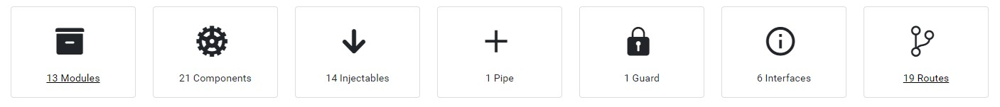
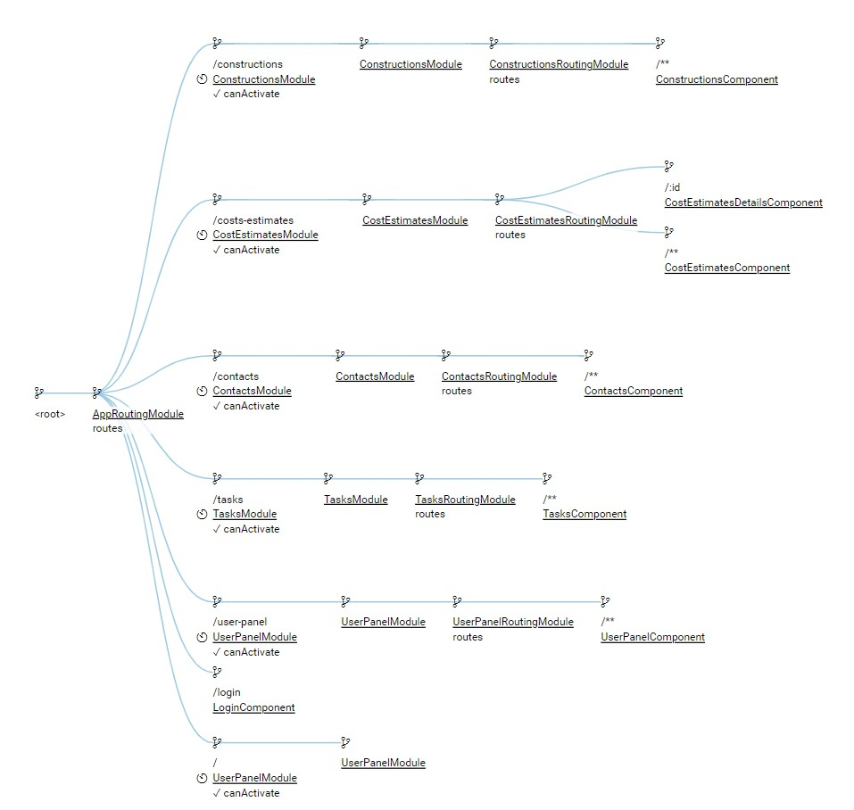
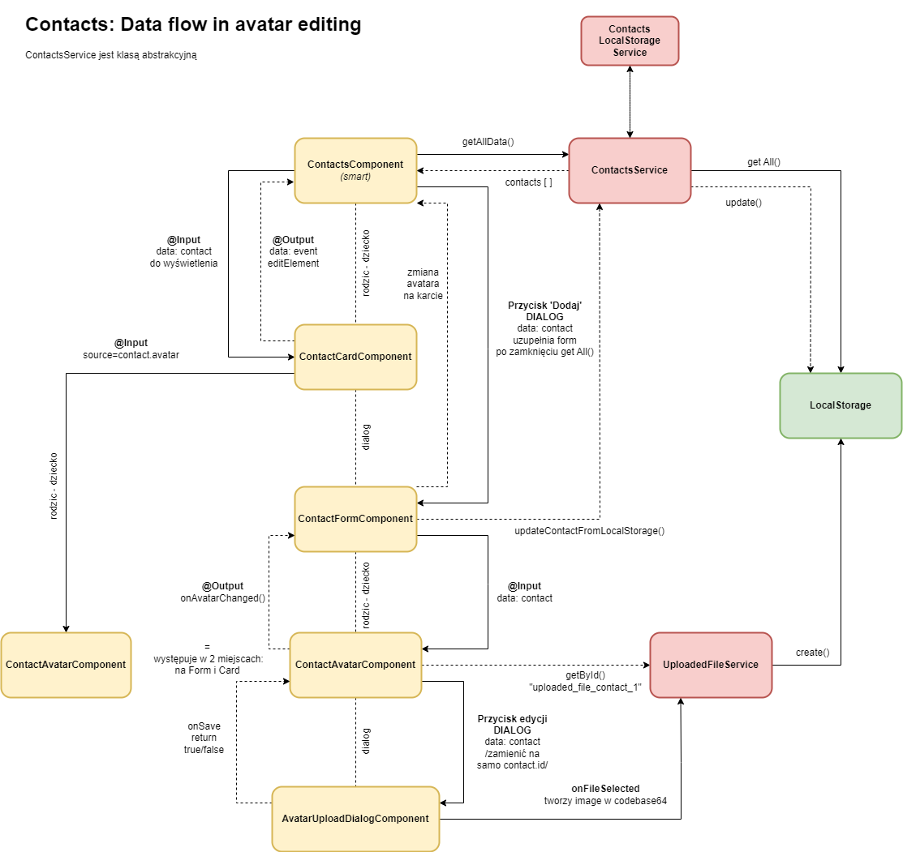

# Site Flow

## Overview
Welcome to SiteFlow, a comprehensive Angular 16 application designed for managing construction businesses. This multi-module application includes features for construction projects, cost estimates, contacts, and tasks. Users can efficiently manage their project lists, cost estimates, contacts associated with specific constructions, and tasks on a Kanban board. The application also offers a seamless experience with features such as dark mode, Google OAuth login, and customizable settings.

#### Live Demo: https://akrzeminska.github.io/site-flow
#### Documentation: https://akrzeminska.github.io/site-flow-documentation

## Table of Contents
* [Overview](#overview)
* [Credentials](#credentials)
* [The building blocks of an application](#thebuildingblocksofanapplication)
* [Features](#features)
* [Technologies Used](#technologies-used)
* [Compodoc Schematics](#compodocschematics)
* [Installation](#installation)
* [Credits](#credits)
* [Author](#author)

## Credentials
To unlock the full potential of SiteFlow, log in using your Gmail account through OAuth.

## The building blocks of an application


## Features

### Angular Material Design
Utilizes Angular Material with a custom theme for a visually appealing and consistent user interface.
### Authentication
Google OAuth login for secure and seamless user authentication.
### Modular Structure
* Multi-module architecture.
* Smart and dumb component division for better maintainability.
### Responsive Design
Responsive Web Design (RWD) with Breakpoint Observer for adaptive layouts.
### Routing
Implements Angular routing with lazy loading for efficient module loading.
* 
### Services and Data Handling
* Services based on abstract classes using local storage.
* Seeder service injects data if not present in local storage.
* Models and services for each application feature.
### Custom Theme
Dark mode implementation using @use and @forward for optimal styling.
### User Panel
Activation of buttons on the main dashboard.
Navigation to specific modules with simple .navigate due to lazy loading challenges.

### Feature Highlights
#### Constructions
* Uses Angular Material Table with Advanced Data Sources.
* Pagination, sorting, and filtering implemented for a seamless user experience.
* Construction forms with reactive forms and validation.
#### Contacts
* Angular Material cards for contacts.
* Dynamic header color based on contact category.
* Avatar management, including uploading images and storing them as base64 in local storage.
* 
#### Cost Estimates
* Expandable table for cost estimates.
* Internal routing for efficient navigation within the cost estimates feature.
#### Tasks
* Drag & Drop functionality using Angular Material for task management.

## Technologies Used
This app was built using:

* HTML, CSS/SCSS
* Typescript
* RxJS, Node.js, NPM
* Angular 16 with lazy loading for optimal performance
* Angular Material with a custom theme for a polished user interface
* OAuth for secure Gmail API integration
* Responsive Web Design (RWD) with Breakpoint Observer
* Custom services based on SOLID principles and abstract classes
* Compodoc for comprehensive documentation

## Roadmap
The application is under active development, and the following features are planned for future releases:

* Advanced cost estimate features.
* Task management enhancements.
* Weather API integration for real-time weather updates.
* Guest login functionality.
* User profiles and access management.
* Internationalization (i18n).
* Hosting configuration beyond GitHub Pages.
* Backend development and database schema creation.

## Installation
To run the Site Flow application locally, follow these steps:

- Clone the repository: ```git clone https://github.com/akrzeminska/site-flow.git```

- Navigate to the project directory: ```cd site-flow```

- Install the required dependencies: ```npm install```

- Start the development server: ```ng serve```

- Open your browser and access the application at ```http://localhost:4200```

## Credits
This application was built using the following resources:

- Icons from Font Awesome
- Fonts from Google Fonts
- Graphics from Pixabay

## Author
Created by _Adelina Krzemińska_
